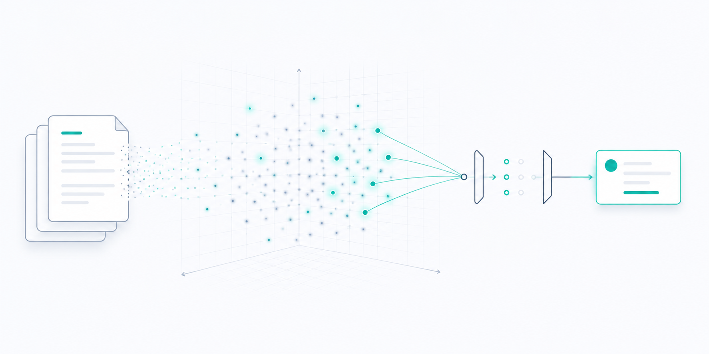
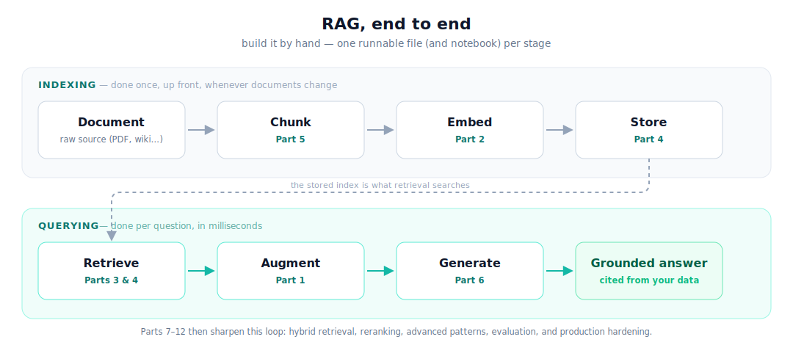

# rag-by-hand

Build a Retrieval-Augmented Generation system from first principles — one runnable
Python file per concept, no frameworks hiding the moving parts. Companion code for
the **RAG from First Principles** series on
[mefby.com](https://www.mefby.com/essays): a 19-part arc, a 12-part core plus a 2026 **Frontier Track**.

> "Build it by hand, understand every line."

Each folder maps 1:1 to an essay. The early parts (2–5) are pure NumPy / standard
library and run offline with no API key. Part 6 assembles them into a working
"chat with your documents" app; Parts 7–12 layer on hybrid retrieval, reranking,
advanced patterns, evaluation, and production hardening. Parts 13–19 are a 2026
**Frontier Track** continuing past the finale: late-interaction retrieval
(ColBERT to ColPali), context-aware chunking, and adaptive routing by query
complexity, then RAG vs long-context vs CAG, securing RAG, structured/SQL RAG, and
building a RAG agent by hand.

Every part ships **two ways to learn the same concept**: a single runnable `.py`
(the whole idea, top to bottom) and a step-by-step **Jupyter notebook** (`.ipynb`)
that rebuilds it cell by cell, with the *why* spelled out before each small step.
Both run offline — a real embedding model / LLM is used automatically when one is
available, and a transparent, deterministic fallback keeps every cell runnable
otherwise. Part 1 is a concept-only notebook (the code starts in Part 2).



## The series

| Part | Topic | Code | Notebook | Essay |
|---|---|---|---|---|
| 1 | Why RAG Exists | [part-01-why-rag](part-01-why-rag/) (concept) | [why-rag.ipynb](part-01-why-rag/why-rag.ipynb) | [read](https://www.mefby.com/essays/why-rag-exists) |
| 2 | Embeddings | [embeddings.py](part-02-embeddings/embeddings.py) | [embeddings.ipynb](part-02-embeddings/embeddings.ipynb) | [read](https://www.mefby.com/essays/embeddings) |
| 3 | Measuring Similarity | [similarity.py](part-03-measuring-similarity/similarity.py) | [similarity.ipynb](part-03-measuring-similarity/similarity.ipynb) | [read](https://www.mefby.com/essays/measuring-similarity) |
| 4 | Vector Databases & Indexing | [vector_db.py](part-04-vector-databases/vector_db.py) | [vector_db.ipynb](part-04-vector-databases/vector_db.ipynb) | [read](https://www.mefby.com/essays/vector-databases) |
| 5 | Documents & Chunking | [chunking.py](part-05-chunking/chunking.py) | [chunking.ipynb](part-05-chunking/chunking.ipynb) | [read](https://www.mefby.com/essays/documents-and-chunking) |
| 6 | Build Your First RAG | [rag_app.py](part-06-build-your-first-rag/rag_app.py) | [rag_app.ipynb](part-06-build-your-first-rag/rag_app.ipynb) | [read](https://www.mefby.com/essays/build-your-first-rag) |
| 7 | Retrieval Deep Dive | [rag_hybrid.py](part-07-retrieval-deep-dive/rag_hybrid.py) | [rag_hybrid.ipynb](part-07-retrieval-deep-dive/rag_hybrid.ipynb) | [read](https://www.mefby.com/essays/retrieval-deep-dive) |
| 8 | Making Retrieval Smarter | [rag_rerank.py](part-08-making-retrieval-smarter/rag_rerank.py) | [rag_rerank.ipynb](part-08-making-retrieval-smarter/rag_rerank.ipynb) | [read](https://www.mefby.com/essays/making-retrieval-smarter) |
| 9 | Advanced Retrieval Patterns | [rag_parent_document.py](part-09-advanced-retrieval-patterns/rag_parent_document.py) | [rag_parent_document.ipynb](part-09-advanced-retrieval-patterns/rag_parent_document.ipynb) | [read](https://www.mefby.com/essays/advanced-retrieval-patterns) |
| 10 | Advanced RAG Architectures | [corrective_rag.py](part-10-advanced-architectures/corrective_rag.py) | [corrective_rag.ipynb](part-10-advanced-architectures/corrective_rag.ipynb) | [read](https://www.mefby.com/essays/advanced-rag-architectures) |
| 11 | Evaluating RAG | [rag_eval.py](part-11-evaluating-rag/rag_eval.py) | [rag_eval.ipynb](part-11-evaluating-rag/rag_eval.ipynb) | [read](https://www.mefby.com/essays/evaluating-rag) |
| 12 | RAG in Production | [rag_production.py](part-12-rag-in-production/rag_production.py) | [rag_production.ipynb](part-12-rag-in-production/rag_production.ipynb) | [read](https://www.mefby.com/essays/rag-in-production) |
| 13 | Late-Interaction Retrieval | [late_interaction.py](part-13-late-interaction/late_interaction.py) | [late_interaction.ipynb](part-13-late-interaction/late_interaction.ipynb) | [read](https://www.mefby.com/essays/late-interaction-retrieval) |
| 14 | Context-Aware Chunking | [context_aware_chunking.py](part-14-context-aware-chunking/context_aware_chunking.py) | [context_aware_chunking.ipynb](part-14-context-aware-chunking/context_aware_chunking.ipynb) | [read](https://www.mefby.com/essays/context-aware-chunking) |
| 15 | Adaptive RAG | [adaptive_rag.py](part-15-adaptive-rag/adaptive_rag.py) | [adaptive_rag.ipynb](part-15-adaptive-rag/adaptive_rag.ipynb) | [read](https://www.mefby.com/essays/adaptive-rag) |
| 16 | RAG vs Long-Context vs CAG | [rag_vs_long_context.py](part-16-rag-vs-long-context/rag_vs_long_context.py) | [rag_vs_long_context.ipynb](part-16-rag-vs-long-context/rag_vs_long_context.ipynb) | [read](https://www.mefby.com/essays/rag-vs-long-context) |
| 17 | Securing RAG | [rag_security.py](part-17-rag-security/rag_security.py) | [rag_security.ipynb](part-17-rag-security/rag_security.ipynb) | [read](https://www.mefby.com/essays/rag-security) |
| 18 | Structured and SQL RAG | [sql_rag.py](part-18-structured-sql-rag/sql_rag.py) | [sql_rag.ipynb](part-18-structured-sql-rag/sql_rag.ipynb) | [read](https://www.mefby.com/essays/structured-sql-rag) |
| 19 | Building a RAG Agent | [rag_agent.py](part-19-rag-agent/rag_agent.py) | [rag_agent.ipynb](part-19-rag-agent/rag_agent.ipynb) | [read](https://www.mefby.com/essays/rag-agent) |

Parts 13–19 are the **Frontier Track** (2026 advances), a continuation past the Part 12 finale.
Part 11 also ships a second runnable, [`long_context_vs_rag.py`](part-11-evaluating-rag/long_context_vs_rag.py)
([notebook](part-11-evaluating-rag/long_context_vs_rag.ipynb)): a leakage-free, fictional-corpus
long-context-LLM vs RAG head-to-head.

## Quick start

```bash
git clone https://github.com/mftnakrsu/rag-by-hand
cd rag-by-hand
pip install -r requirements.txt

# Parts 2–5 run offline, no API key:
python part-03-measuring-similarity/similarity.py

# Part 6 — the full app. Set one provider (below), then:
python part-06-build-your-first-rag/rag_app.py
```

Prefer to learn step by step? Open the matching notebook instead — every cell runs
offline, no API key required:

```bash
pip install jupyter           # one-time, to run the notebooks
jupyter notebook part-03-measuring-similarity/similarity.ipynb
```

Or run any notebook in your browser with zero setup — every notebook carries an
**Open in Colab** badge at the top.

## Example run

`similarity.py` is pure NumPy and runs with no model, key, or network. You should see:

```text
Three tiny 2-D vectors (real embeddings just have more dimensions):
  A = [3, 4]
  B = [4, 3]
  C = [6, 8]   (A doubled: same direction, twice as long)

Pairwise scores -- three metrics, three different verdicts:
  pair | euclidean |   dot |  cosine
--------------------------------------
   A,B |      1.41 |    24 |    0.96
   A,C |      5.00 |    50 |    1.00
   B,C |      5.39 |    48 |    0.96

Top-k retrieval (the RAG ranking function):
  query = [1.0, 0.0]
  1. score=  1.00  chunk_0  same direction, far away
  2. score=  0.97  chunk_2  near-aligned
  3. score=  0.71  chunk_1  45 degrees off

  Note chunk_0 ties for first despite being 9x longer than the query:
  cosine ignores length and rewards pure direction -- the whole point.
```

## LLM providers

The generation step (Part 6 onward) is isolated behind a single `generate(prompt)`
function so the provider is a one-line swap. Three backends are shown:
**OpenAI** (the default), **Ollama** (local, free, no key), and
**Anthropic / Claude**. Set the matching API key — or run Ollama locally — and
swap the function body. The retrieval, chunking, and similarity code is provider-
agnostic and needs no key at all.

## License

MIT — see [LICENSE](LICENSE).
